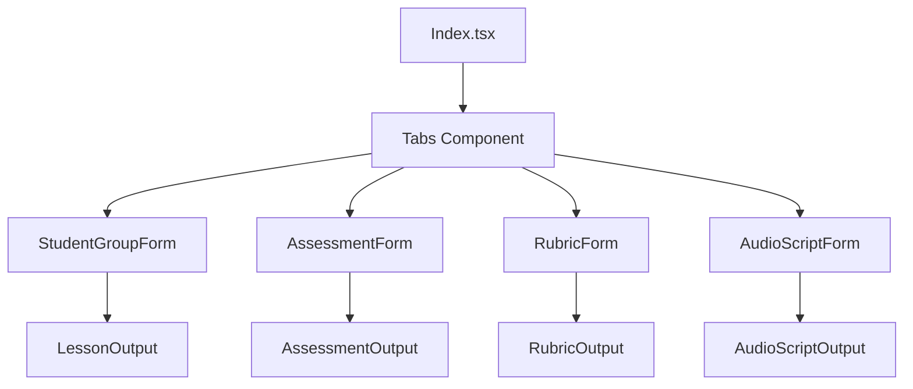
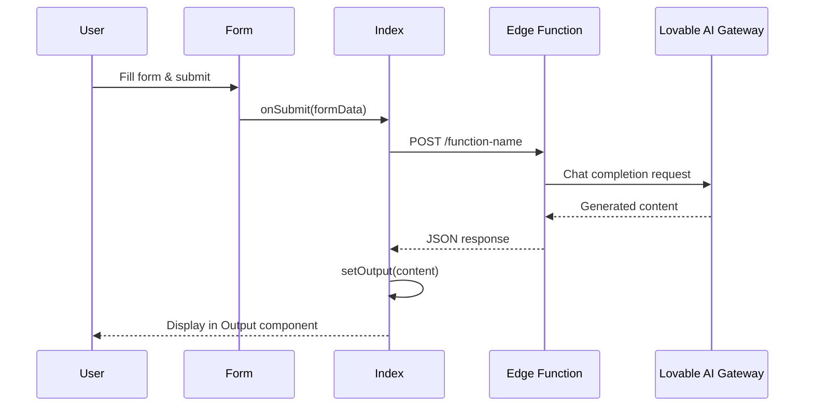

# Educator Tools Suite - Architecture Documentation

> **Last Updated:** December 2024  
> **Version:** 1.0

---

## Project Overview

The **Educator Tools Suite** is a web application designed to help teachers differentiate instruction and create AI-resistant assessments. It provides four AI-powered tools:

1. **Lesson Differentiator** - Adapts lessons to different student reading levels and needs
2. **AI-Resistant Assessment Generator** - Creates assessments that can't be easily completed by AI
3. **Analytic Rubric Generator** - Builds detailed rubrics for assessment criteria
4. **Audio Script Generator** - Converts lessons to text-to-speech ready scripts

---

## File Structure

```
project-root/
├── docs/
│   └── ARCHITECTURE.md          # This documentation file
├── src/
│   ├── components/
│   │   ├── ui/                  # shadcn/ui component library
│   │   │   ├── accordion.tsx
│   │   │   ├── alert-dialog.tsx
│   │   │   ├── button.tsx
│   │   │   ├── card.tsx
│   │   │   ├── checkbox.tsx
│   │   │   ├── dialog.tsx
│   │   │   ├── input.tsx
│   │   │   ├── label.tsx
│   │   │   ├── select.tsx
│   │   │   ├── tabs.tsx
│   │   │   ├── textarea.tsx
│   │   │   ├── toast.tsx
│   │   │   └── ... (40+ components)
│   │   ├── AssessmentForm.tsx   # Form for AI-resistant assessments
│   │   ├── AssessmentOutput.tsx # Display generated assessments
│   │   ├── AudioScriptForm.tsx  # Form for audio script generation
│   │   ├── AudioScriptOutput.tsx# Display generated audio scripts
│   │   ├── LessonOutput.tsx     # Display differentiated lessons
│   │   ├── NavLink.tsx          # Navigation component
│   │   ├── RubricForm.tsx       # Form for rubric generation
│   │   ├── RubricOutput.tsx     # Display generated rubrics
│   │   └── StudentGroupForm.tsx # Form for student group profiles
│   ├── hooks/
│   │   ├── use-mobile.tsx       # Mobile detection hook
│   │   └── use-toast.ts         # Toast notification hook
│   ├── integrations/
│   │   └── supabase/
│   │       ├── client.ts        # Supabase client (auto-generated)
│   │       └── types.ts         # Database types (auto-generated)
│   ├── lib/
│   │   ├── differentiation.ts   # Differentiation helper functions
│   │   └── utils.ts             # Utility functions (cn, etc.)
│   ├── pages/
│   │   ├── Index.tsx            # Main application page
│   │   └── NotFound.tsx         # 404 page
│   ├── types/
│   │   ├── assessment.ts        # Assessment type definitions
│   │   ├── audioScript.ts       # Audio script type definitions
│   │   ├── rubric.ts            # Rubric type definitions
│   │   └── studentGroup.ts      # Student group type definitions
│   ├── App.tsx                  # Root app component with routing
│   ├── App.css                  # Global app styles
│   ├── index.css                # Tailwind + design system tokens
│   └── main.tsx                 # React entry point
├── supabase/
│   ├── functions/
│   │   ├── differentiate-lesson/
│   │   │   └── index.ts         # Lesson differentiation AI endpoint
│   │   ├── generate-assessment/
│   │   │   └── index.ts         # Assessment generation AI endpoint
│   │   ├── generate-audio-script/
│   │   │   └── index.ts         # Audio script AI endpoint
│   │   └── generate-rubric/
│   │       └── index.ts         # Rubric generation AI endpoint
│   └── config.toml              # Supabase configuration
├── public/
│   ├── favicon.ico
│   ├── placeholder.svg
│   └── robots.txt
├── index.html                   # HTML entry point
├── tailwind.config.ts           # Tailwind configuration
├── vite.config.ts               # Vite bundler configuration
└── package.json                 # Dependencies
```

---

## Core Components

### Main Page (`src/pages/Index.tsx`)

The central hub with a tabbed interface containing all four tools:

| Tab | Form Component | Output Component |
|-----|----------------|------------------|
| Differentiate | `StudentGroupForm` | `LessonOutput` |
| Assessment | `AssessmentForm` | `AssessmentOutput` |
| Rubric | `RubricForm` | `RubricOutput` |
| Audio | `AudioScriptForm` | `AudioScriptOutput` |

### Form Components

| Component | Purpose | Key Inputs |
|-----------|---------|------------|
| `StudentGroupForm` | Captures student group profile for differentiation | Group name, reading level, ELL status, accommodations, lesson content |
| `AssessmentForm` | Collects assessment parameters | Lesson title, subject, grade, objectives, AI policy, local context |
| `RubricForm` | Gathers rubric requirements | Assessment description, learning objectives, number of criteria |
| `AudioScriptForm` | Prepares content for TTS conversion | Lesson content, target language, reading level |

### Output Components

| Component | Features |
|-----------|----------|
| `LessonOutput` | Displays differentiated lesson, copy/download buttons |
| `AssessmentOutput` | Renders assessment markdown, copy/download as .md |
| `RubricOutput` | Shows rubric tables, copy/download functionality |
| `AudioScriptOutput` | Displays script with word count and reading time estimate |

---

## Design System

### Color Palette

```css
/* Primary Colors */
--primary: 221 50% 45%          /* Calming Blue */
--primary-foreground: 0 0% 100%

/* Accent Colors */
--accent: 160 45% 45%           /* Teal Green */
--accent-foreground: 0 0% 100%
--accent-warm: 35 85% 55%       /* Warm Orange */

/* Background & Surface */
--background: 40 30% 97%        /* Warm Off-White */
--card: 40 30% 99%              /* Card White */
--muted: 40 20% 94%             /* Muted Surface */

/* Text Colors */
--foreground: 220 20% 20%       /* Dark Text */
--muted-foreground: 220 15% 45% /* Secondary Text */

/* Semantic Colors */
--success: 160 60% 40%          /* Green */
--warning: 35 85% 55%           /* Orange */
--destructive: 0 70% 50%        /* Red */
```

### Typography

- **Font Family:** Nunito (Google Fonts)
- **Weights:** 400 (regular), 600 (semibold), 700 (bold)

### Custom CSS Utilities

```css
.shadow-soft        /* Subtle elevation */
.shadow-glow        /* Accent glow effect */
.animate-fade-in    /* Fade in animation */
.animate-slide-in   /* Slide in animation */
.prose-lesson       /* Lesson content typography */
```

---

## Backend Architecture

### Edge Functions

All AI functionality is powered by Supabase Edge Functions that connect to the **Lovable AI Gateway**.

| Function | Endpoint | AI Model | Purpose |
|----------|----------|----------|---------|
| `differentiate-lesson` | `/differentiate-lesson` | `google/gemini-2.5-flash` | Adapt lessons to student needs |
| `generate-assessment` | `/generate-assessment` | `google/gemini-2.5-flash` | Create AI-resistant assessments |
| `generate-rubric` | `/generate-rubric` | `google/gemini-2.5-flash` | Build analytic rubrics |
| `generate-audio-script` | `/generate-audio-script` | `google/gemini-2.5-flash` | Convert to TTS-ready text |

### AI Integration Pattern

All edge functions follow this pattern:

```typescript
// 1. CORS handling
if (req.method === 'OPTIONS') {
  return new Response(null, { headers: corsHeaders });
}

// 2. Parse request body
const { param1, param2 } = await req.json();

// 3. Get API key from environment
const apiKey = Deno.env.get("LOVABLE_API_KEY");

// 4. Call Lovable AI Gateway
const response = await fetch("https://ai.gateway.lovable.dev/v1/chat/completions", {
  method: "POST",
  headers: {
    "Authorization": `Bearer ${apiKey}`,
    "Content-Type": "application/json",
  },
  body: JSON.stringify({
    model: "google/gemini-2.5-flash",
    messages: [
      { role: "system", content: SYSTEM_PROMPT },
      { role: "user", content: userPrompt },
    ],
  }),
});

// 5. Return generated content
const data = await response.json();
return new Response(JSON.stringify({ content: data.choices[0].message.content }));
```

---

## Data Flow

### Component Interaction Flow



### AI Generation Workflow



---

## Type Definitions

### StudentGroup (`src/types/studentGroup.ts`)

```typescript
interface StudentGroup {
  groupName: string;
  numberOfStudents: number;
  readingLevel: 'below' | 'on' | 'above' | 'advanced';
  lexileLevel: string;
  homeLanguage: string;
  ellStatus: string;
  iepStatus: string;
  accommodations: string[];
  notes: string;
}
```

### AssessmentInput (`src/types/assessment.ts`)

```typescript
interface AssessmentInput {
  lessonTitle: string;
  subject: string;
  gradeLevel: string;
  learningObjectives: string[];
  aiPolicy: 'prohibited' | 'limited_assist' | 'encouraged_with_citation';
  localContext: {
    schoolName: string;
    city: string;
    state: string;
    additionalDetails: string;
  };
}
```

### RubricInput (`src/types/rubric.ts`)

```typescript
interface RubricInput {
  assessmentDescription: string;
  learningObjectives: string[];
  numCriteria: number;
}
```

### AudioScriptInput (`src/types/audioScript.ts`)

```typescript
interface AudioScriptInput {
  lessonContent: string;
  language: string;
  readingLevel: string;
}
```

---

## Dependencies

### Core Framework
- **React 18** - UI library
- **React Router DOM** - Client-side routing
- **Vite** - Build tool and dev server

### UI Components
- **shadcn/ui** - Component library (40+ components)
- **Radix UI** - Headless UI primitives
- **Lucide React** - Icon library
- **TailwindCSS** - Utility-first CSS
- **tailwindcss-animate** - Animation utilities

### Backend Integration
- **@supabase/supabase-js** - Supabase client
- **@tanstack/react-query** - Server state management

### Content Rendering
- **react-markdown** - Markdown to React components

### Forms & Validation
- **react-hook-form** - Form management
- **@hookform/resolvers** - Validation resolvers
- **zod** - Schema validation

### Utilities
- **clsx** - Conditional classnames
- **tailwind-merge** - Merge Tailwind classes
- **class-variance-authority** - Component variants
- **date-fns** - Date utilities

---

## Key Patterns

### 1. Form → API → Output Pattern

Each tool follows the same pattern:
1. User fills form component
2. Form calls `onSubmit` with typed input
3. Index.tsx invokes edge function
4. Response updates state
5. Output component renders result

### 2. Markdown Rendering

All generated content is rendered using `react-markdown` with custom component styling:

```tsx
<ReactMarkdown
  components={{
    h1: ({ children }) => <h1 className="text-2xl font-bold">{children}</h1>,
    table: ({ children }) => <table className="border-collapse">{children}</table>,
    // ... other customizations
  }}
>
  {content}
</ReactMarkdown>
```

### 3. Copy/Download Actions

All output components include:
- **Copy to Clipboard** - Uses `navigator.clipboard.writeText()`
- **Download as File** - Creates Blob and triggers download

---

## Future Considerations

- **Authentication** - Add teacher login to save student groups and generated content
- **Database Storage** - Persist student groups and generated materials
- **Text-to-Speech** - Integrate ElevenLabs for actual audio generation
- **History/Versioning** - Track previously generated content
- **Sharing** - Allow teachers to share materials with colleagues
